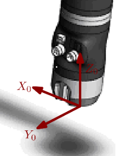
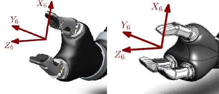

# CS Jaco 2 ROS Package

## Maintainer 

- [Adrian Zwiener](http://www.cogsys.cs.uni-tuebingen.de/mitarb/zwiener/welcome_e.html) <<adrian.zwiener@uni-tuebingen.de>>, [Cognitive Systems](http://www.cogsys.cs.uni-tuebingen.de/), University of Tübingen

## Table of contents
- [Description](#description)
- [Dependencies](#dependencies)
- [Installation](#installation)

## Description

This package contains a driver and ROS interfaces for the Kinova Jaco 2 manipulator. Besides, a kinematic, a dynamic model, and a moveit configuration is included. Moreover, we supply tools for calibration of the dynamic model and the Jaco's accelerometers.

It contains:
-  [the diver](#jaco2_driver) containg several controller and basic input and output
-  [a library](#jaco2_kin_dyn_lib) for kinematic and dynamic models
- [a moveit config](#jaco2_moveit_config) to use the Jaco 2 with moveit
- [the model](#jaco2_description) of the Jaco 2


## Dependencies
### Build Dependencies
- [tracIK](http://wiki.ros.org/trac_ik)

### Run Dependencies
-  [MoveIt!](http://moveit.ros.org/)
If you want to use MoveIt to display your robot state and plan trajectories.

## Installation

i. Simply install tracIK, and MoveIt! (if required) using apt-get: 
```
	sudo apt-get install ros-<distro>-moveit*
	sudo apt-get install ros-<distro>-trac-ik
```
ii. Clone repository and build your workspace:
```
	cd <workspace>/src
	git clone https://github.com/cogsys-tuebingen/jaco2_ros.git
	cd ..
	rosdep install -y -r -i --from-paths src
	catkin_make
```
Optionally, you can build the *TORQUE_EXPERT_MODE* ** but not recommended**. 
This mode sets all gravity parameters of the dynamic model to zero, thus you have to compensate gravity yourself while using torque control. This mode is **not recommended**. Use only if you are really sure that your commands are correct. Compile with:
```
	catkin_make -DTORQUE_EXPERT_MODE=True
```
iii. Finally, copy the udev rule from the jaco2_driver folder to your system:
```
	sudo cp src/jaco2_ros/jaco2_driver/udev/10-kinova-arm.rules /etc/udev/rules.d/

```
Now you can use the Jaco 2 with ROS!

## jaco2_driver

### Start

Currently, there are 2 launch files for our 2 Jaco 2s. To bring up one Jaco2 with calibrated accelerometers launch the launch file of your Jaco2:
```
	roslaunch jaco2_driver jaco2-1_calib.launch
	roslaunch jaco2_driver jaco2-2_calib.launch
```
The label indicating which Jaco 2 you use, can be found on the back of the Jaco 2. If you do not want to use the calibration or two arms simultaneously you can also start the arm by:
```
rosrun jaco2_driver jaco2_driver_node
```
### Topics
The Jaco 2 Node publishes information on topics marked with: 
```
<node_name>/out/x
```
You can publish commands to the Jaco 2 on topics with:
```
<node_name>/in/x
```
- **joint_velocity** topic:
To publish joint velocities to the controller publish our velocity with at least a rate of 20 Hz. Otherwise your commands will be ignored. Be careful while publishing velocities, collisions are currently not avoided!

- **in/cartesian_velocity** topic:
Publish cartesian velocties geometry_msgs/Twist to control the Jaco 2. Publish velocites at least with 20 Hz, otherwise your commands will be ignored. Linear velocites are in base frame coordinates (X~0~, Y~0~, Z~0~). Angular velocites have to be given in the End Effector frame (X~6~, Y~6~, Z~6~), c,f, following images.



- **joint_torque** topic:
Similar to the **joint_velocity** topic but torques have to be published.
Commands while not have any effect until the **in/toggle_torque_control** service is called.
### Action Server
Currently, we have 3 action servers to control the arm:

- **arm_joint_angles**:  
Move the arm to a given joint postion.
== Attention:==
== Use this command only if you are certain that the Jaco 2 will not collide with its enviroment or with itself.==
== NEVER EVER SET ALL JOINT ANGLES TO 0  ==

- **finger_joint_angles**: 
Control the fingers to the given position.
- **gripper_command**:
Performs a power grip. Closes the gripper until the finger do not move anymore. 
Usage jaco2_msgs/GripperControlActionGoal:

| type | name   | function |
|-|-|-|
| bool | useFinger1 | If true finger 1 is used for power grip. |
| bool | useFinger2 | If true finger 2 is used for power grip. | 
| bool | useFinger3 | If true finger 3 is used for power grip. | 
| bool | usePos | If a finger is not used for the power grip set finger to provided position.|
|int | posFinger1 | Encoder position of finger 1. 0 is open 7200 is closed.|
|int|posFinger2| Encoder position of finger 1. 0 is open 7200 is closed.|
|int|posFinger3| Encoder position of finger 1. 0 is open 7200 is closed.|

Thus, you can deiced which finger to use for a power grip (at least two), in instance finger 1 & finger 2 or finger 1 & finger 3 . The unused finger can be set to an arbitrary position. In addition, you can use the action server to open the gripper just send:

	useFinger1: False
	useFinger2: False
	useFinger3: False
	usePos: True
	posFinger1: 0
	posFinger2: 0
	posFinger3: 0

Or set the fingers to any arbitrary configuration.

- **follow_joint_trajectory**:
Trajectory tracking controller using PID velocity control.

### Services
There are 5 services available:

- **/in/home_arm**:
Brings the arm to its home position.== Only use this if you are sure that the Jaco 2 will not collide with its enviroment. Currently, this service is not available if you want to use a "left" Jaco  2 arm.==

- **/in/set_torque_zero**:
Sets a torque sensor to zero. Only use this command in torque zero position:
 [ 0, 180° 180°, 0, 0, 180°]

- **/in/set_payload**
Sets the gravity parameters for a payload in the end effector frame (see image).

Default values in SI units:

	"mass: 0.0
	  com_x: 0.0
	  com_y: 0.0
	  com_z: 0.0" 
	  
The distance between the wrist frame and the end effector frame is in z_6 direction  l_6 = -0.16 m.

- **/in/stop**:
Stops the API any command will be ignored.

- **/jaco_arm_driver/in/start**:
Releases the API if it was stopped previously.

- **in/enable_admittance_mode**:
If **true** is send, the Jaco 2 is in an impedance control mode.  Therefore, you can push the Jaco 2 into any configuration you like.
However, since this employs velocity control the joints are much stiffer than using **in/enable_gravity_compensation_mode**.
The activate it sending **false**. If you want to toggle between **impedance/admittance** mode and **gravity_compeonsation**, it is best to deactivate on before activting the other.


- **in/enable_gravity_compensation_mode**
If **true** is send, the Jaco 2 is in torque control mode an will only compensete torques due to gravity. Therefore, you can push the Jaco 2 into any configuration you like. This mode is deactivated if links are to close to each other. To activated the gravity compensation mode send false to the service, change the configuration to a more extended one e.g. via the controller, and finally enable the compensation mode by sending ture once again.

- **in/toggle_torque_control**
Enables/disables torque control. Before, a torque command is executed this services has to be called. Calling it again will immediately disable torque control.

- **in/shutdown**
Shuts the driver down. Finishes the node.

- Optional **in/set_torque_expert_mode**
If you built the *TORQUE_EXPERT_MODE* this service is available. **Before, calling this service: Make sure the Jaco 2 is in the following position  [ 0, 180° 180°, 0, 0, 0°]**. Also set all torque sensors to zero (In the jaco2_driver" package a script is provided doing booth. Make sure the environment of the Jaco 2 is collision free.)
You need to provide a password to enable the *TORQUE_EXPERT_MODE*: password = ExpertMode.
Sending the wrong password will restore the original gravity parameters.

## jaco2_kin_dyn_lib
A wrapper library for the [orocos Kinematics and Dynamics Library (KDL)](http://wiki.ros.org/orocos_kdl). Besides, this library contains some additional methods, e.g. regression matrix for dynamic calibration or a modified recursive Newton algorithm used e.g. in external torque estimation.
TODO ...

## jaco2_moveit_config
Start MoveIt! and rviz by using if (you used rosrun to start the arm):
```
roslaunch jaco2_moveit_config moveit_full_rviz.launch
```
If you used one of the launch files 'jaco2-1(2).launch' to start the driver, you need to remap controller and joint states as followed:
```
	roslaunch jaco2_moveit_config moveit_full.launch joint_state_topic:=<joint_state topic> controller_in:=<jaco controller> 
```
```
<joint_state_topic>:
	/jaco_21_driver/out/joint_states
	/jaco_22_driver/out/joint_states
<jaco controller>:
	jaco_21
	jaco_22
```
Now you can plan and execute trajectories. For a simulation run:
```
roslaunch jaco2_moveit_config demo.launch
```


## jaco2_description
The robot model which holds  all parameters needed for the kinematic and the dynamic model. Additionally, meshes are included for visualization and collision checking.


